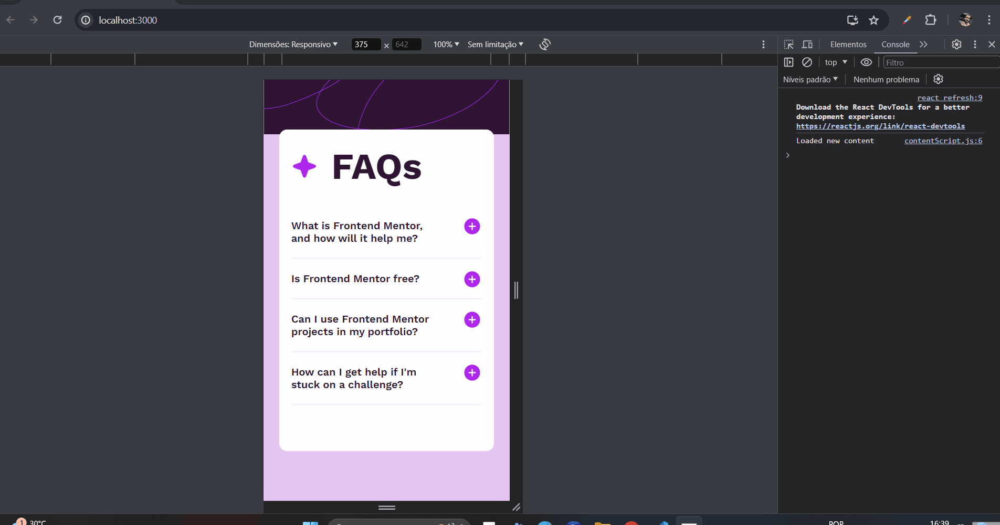

# faq-accordion-main-react

É um desafio do Frontend Mentor de um projeto sobre acordeão com várias guias que se espandem e retraem a se clicar nelas. Este projeto usa como principal tecnologia o `React js`.

## Meus prinipais desafios:

Meu principal desafio foi em elaborar a lógica para fazer a guia, que se inicia retraida, se expandir para mostrar informções sobre dúvidas.

## Tecnologias Utilzadas:

- HTML;
- JavaScript;
- React.js;

### Bibliotecas usadas:

    Styled Componets;

 

